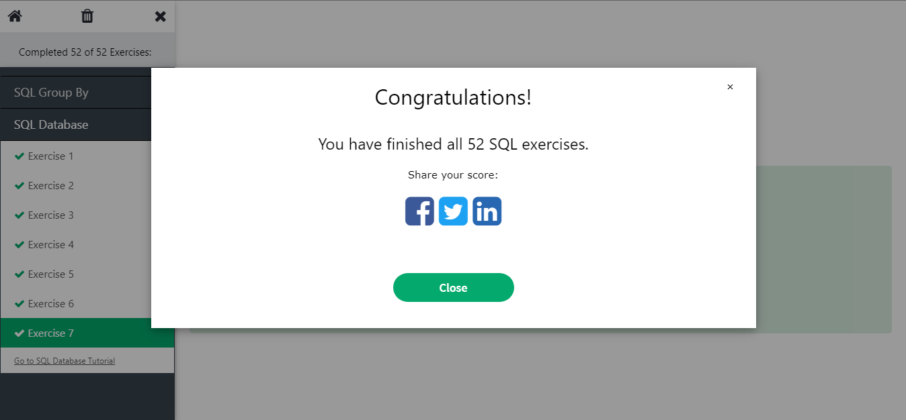
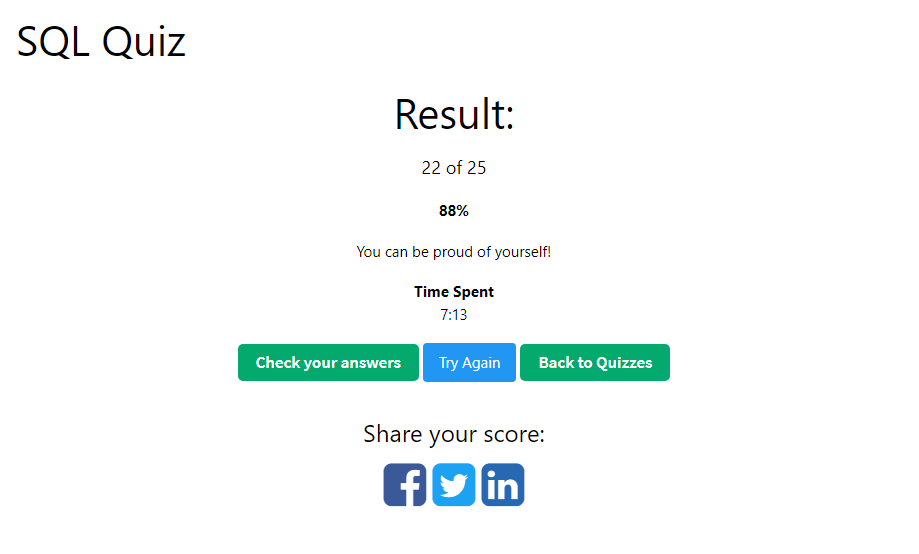
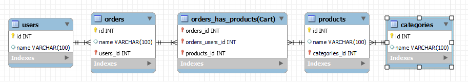
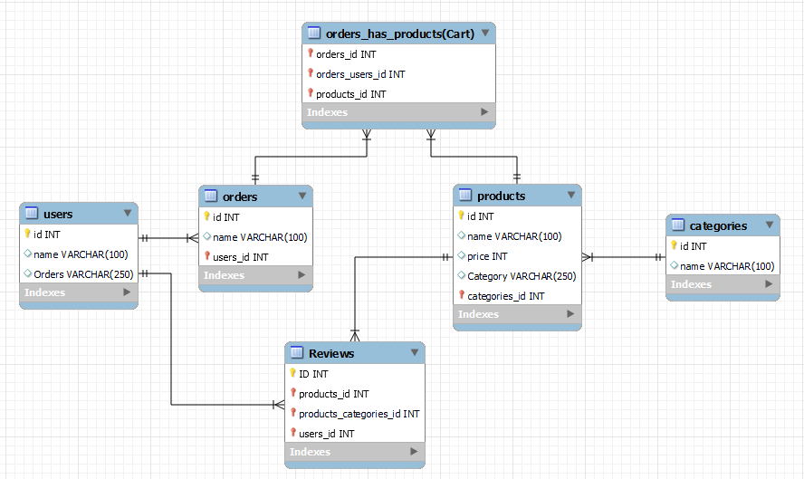

# SQL y Relaciones

## 1. Ejercicios W3Schools

- Realiza los siguientes ejercicios sql de w3schools.
- Realiza el quiz de w3schools.
- Recursos para hacer los ejercicios.





## 2. MySQL

### 2.1 Crear diagrama

Crea un diagrama utilizando MySQL Workbench de una base de datos de un e-commerce (tienda online) con las siguientes tablas:
- Tabla Users
- Tabla Products
- Tabla Orders
- Tabla Categories

Debe mostrar los tipos de relaciones entre cada tabla. *Recuerda que en el caso de una relación muchos a muchos necesitarás una tabla intermedia.*



### 2.2 Ejecute las siguientes consultas SQL

A continuación, deberá realizar las siguientes consultas SQL:

#### 2.2.1 INSERTAR DATOS

- Inserte al menos 5 nuevos usuarios.
- Inserte al menos 5 nuevos productos.
- Inserte al menos 5 nuevos pedidos(orders).
- Inserte al menos 2 tipos de categorías.

``` SQL
INSERT INTO Users (name) values ('User1'), ('User2'), ('User3'), ('User4'), ('User5');
INSERT INTO Products (name) values ('Product1'), ('Product2'), ('Product3'), ('Product4'), ('Product5');
INSERT INTO Orders (name) values ('Order1'), ('Order2'), ('Order3'), ('Order4'), ('Order5');
INSERT INTO categories (name) values ('Category1'), ('Category2');
```
		
#### 2.2.2 ACTUALIZAR DATOS

- Cambiar el nombre de un producto. Para ello, genera una consulta que afecte solo a un determinado producto en función de su id.
- Cambiar el precio de un producto a 50€. Para ello, genera una consulta que afecte solo a un determinado producto en función de su  id.

``` SQL
UPDATE Products SET name = 'Tarta' WHERE ID = 1;

ALTER TABLE Products ADD price INT(10);
UPDATE Products SET price = '50' WHERE ID = 2;
```

#### 2.2.3 OBTENER DATOS

- Seleccione todos los productos con un precio superior a 20€.
- Muestre de forma descendente los productos.
- Seleccione todos los productos y que muestre la categoría a la que pertenecen.
- Seleccione todos los usuarios y muestre sus pedidos.
- Selecciona un producto por su id y que muestre la categoría a la que pertenece.
- Seleccione a un usuario por su id y muestre los pedidos que tiene.

``` SQL
SELECT * FROM Products WHERE price >= 20;
SELECT * FROM Products ORDER BY id DESC;
SELECT Category FROM Products;
SELECT Orders FROM Users;
SELECT Category FROM Products WHERE ID = 3;
SELECT Orders FROM Users WHERE ID = 4;
```

## 3 Extra

### 3.1 Borrar datos

- Elimina un producto por su id.

``` SQL
DELETE FROM Products WHERE id = 5;
```

### 3.2 Actualizar diagrama

Crea una nueva tabla reviews y añadela al diagrama especifica también el tipo de relación.



### 3.3 Ejecute las siguientes consultas SQL

A continuación, deberá realizar las siguientes consultas SQL:

#### 3.3.1 INSERTAR DATOS

- Inserte al menos 5 nuevas reviews.

``` SQL
INSERT INTO Reviews (text) values ('review1'), ('review2'), ('review3'), ('review4'), ('review5');
```
	
#### 3.3.2 ACTUALIZAR DATOS

- Cambia el contenido de una review

``` SQL
UPDATE Reviews SET text = 'Review editada' WHERE id = 2;
```

#### 3.3.3 OBTENER DATOS

- Seleccione todas las reviews.
- Seleccione todos los productos con sus respectivas reviews.
- Muestre un producto con sus reviews.
- Muestre los productos junto a la categoría a la que pertenece y sus reviews.
- Seleccione un usuario y muestre sus pedidos junto a los productos que contiene cada pedido.

<!-- Definitivamente estoy haciendo algo mal. Voy a parar y mañana lo corrijo y lo termino de hacer todo bien -->

#### 3.3.4 BORRAR DATOS

- Elimina una review por su id.

``` SQL
DELETE FROM Reviews WHERE id = 4;
```